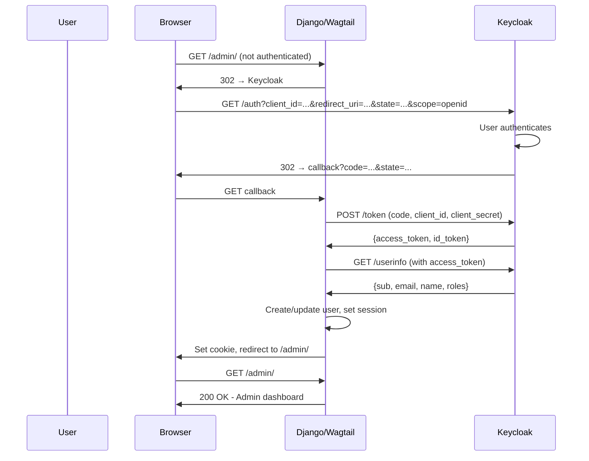
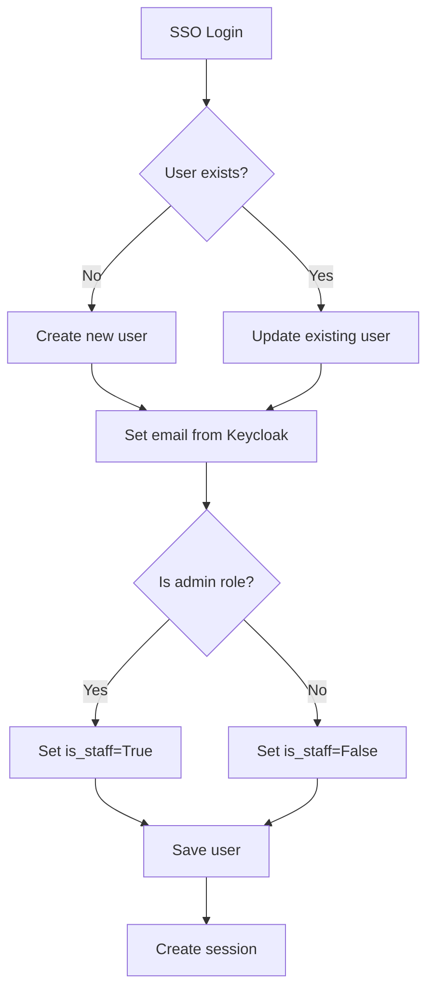
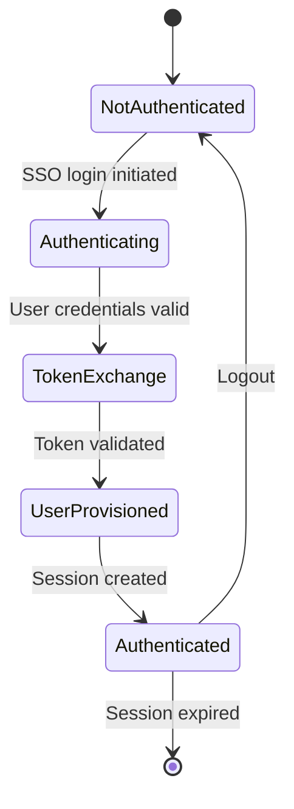

# System Architecture — Wagtail + Keycloak SSO

## Stack Overview

```
┌─────────┐     ┌─────────┐     ┌───────────┐     ┌─────────┐
│ Browser │ ──► │ Django  │ ──► │allauth   │ ──► │Keycloak│
│         │ ◄── │ +Wagtail│ ◄── │ OIDC     │ ◄── │  (IdP) │
└─────────┘     └─────────┘     └───────────┘     └─────────┘
      │              │                │
      │              ▼                ▼
      │         ┌─────────┐     ┌─────────┐
      │         │Session  │     │  JWKS   │
      │         │ Cookie  │     │ Endpoint│
      │         └─────────┘     └─────────┘
      │
      ▼
┌─────────────────┐
│ Wagtail Admin   │
│ (protected)     │
└─────────────────┘
```

## Components

| Component | Role |
|----------|------|
| Browser | User interface, cookie storage |
| Django | Web framework, session management |
| Wagtail | CMS, protected admin area |
| django-allauth | OAuth2/OIDC integration |
| Keycloak | Identity Provider (IdP) |

## Auth Flow



## Keycloak Configuration

### Realm
- Name: demo-realm
- Purpose: Isolated security domain

### Client
- Client ID: wagtail-demo
- Type: confidential (requires client secret)
- Protocol: openid-connect
- Authentication: client_secret_basic

### Redirect URIs
```
http://localhost:8000/accounts/oidc/keycloak/login/callback/
http://127.0.0.1:8000/accounts/oidc/keycloak/login/callback/
```

## User Provisioning Model



### Adapter Logic
```python
def populate_user(self, request, sociallogin, data):
    user = super().populate_user(request, sociallogin, data)
    user.email = data.get('email')
    # Map admin role
    roles = data.get('realm_access', {}).get('roles', [])
    if 'admin' in roles:
        user.is_staff = True
        user.is_superuser = True
    return user
```

## Session Lifecycle



## Key Endpoints

| Endpoint | Purpose |
|----------|---------|
| `/admin/` | Wagtail admin (protected) |
| `/accounts/oidc/keycloak/login/` | Initiate SSO |
| `/accounts/oidc/keycloak/login/callback/` | OIDC callback |
| `/auth/realms/{realm}/.well-known/openid-configuration` | OIDC discovery |
| `/auth/realms/{realm}/protocol/openid-connect/certs` | JWKS |
| `/auth/realms/{realm}/protocol/openid-connect/token` | Token exchange |

## Security Settings

### Django (Django 4.x)
- SESSION_COOKIE_SAMESITE = 'Lax'
- SESSION_COOKIE_SECURE = True (production)
- CSRF_COOKIE_SAMESITE = 'Lax'

### Keycloak
- Client authentication: client_secret_basic
- Access token lifespan: 300 seconds
- SSO session idle: 1800 seconds
